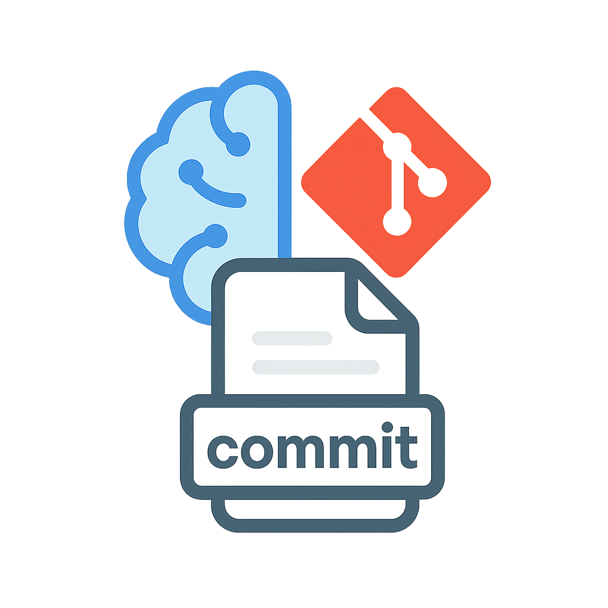

#   MCP Commit Helper

<div align="center">
  


[](https://www.npmjs.com/package/@pekno/mcp-commit-helper)
[](https://www.npmjs.com/package/@pekno/mcp-commit-helper)

</div>

An MCP server that helps you write better Git commit messages by leveraging LLMs like Claude. It analyzes your Git diff and suggests appropriate, conventional commit messages.

### MCP Integration

To use with an MCP client configuration, add this to your config:

```json
{
  "mcpServers": {
    "commit-helper": {
      "command": "npx",
      "args": ["-y", "@pekno/mcp-commit-helper"]
    }
  }
}
```

You can also set environment variables directly in your MCP configuration:

```json
{
  "mcpServers": {
    "commit-helper": {
      "command": "npx",
      "args": ["-y", "mcp-commit-helper"],
      "env": {
        "MCP_COMMIT_PROMPT": "Write a conventional commit message for these changes:\\n\\n{diff}"
      }
    }
  }
}
```

## Available Tools

This MCP server exposes the following tools:

- `initialize-project`: Initialize a Git repository path
- `get-git-diff`: Show the current Git diff
- `generate-commit-message`: Generate a commit message based on the Git diff
- `create-commit`: Create a Git commit with the provided message

## Example Workflow

When talking to an LLM like Claude with MCP support, you can use commands like:

1. Initialize the project:
   ```
   initialize-project at C:/path/to/your/repo
   ```

2. Generate a commit message:
   ```
   generate-commit-message
   ```

3. Create the commit with the suggested message:
   ```
   create-commit with message "feat: implement new feature" and addAll: true
   ```

## Customization

### Environment Variables (Optional)

The MCP Commit Helper works perfectly out of the box, but you can optionally customize the commit message prompt by setting environment variable:

- `MCP_COMMIT_PROMPT` (optional): Customize the conventional commit prompt
  
  Default:
  ```
  Based on the following git diff, please write a commit message following the Conventional Commits format (type(scope): description).

  Types include: feat, fix, docs, style, refactor, test, chore, etc.

  Focus on being concise but descriptive, using imperative mood.
  Include a brief description of the changes after the header if helpful.

  Here's the git diff:

  {diff}
  ```

When customizing prompts, use these template variables:
- `{diff}`: Will be replaced with the actual Git diff
- `{scope}`: Will be replaced with scope info if provided

You might want to customize these prompts to:
- Follow your team or organization's commit message conventions
- Focus on specific aspects of the code changes
- Add reminders about commit policies or standards
- Change the language or tone of the commit message

## License

MIT